# Accounting-Ledger

# My Project overview

============================

For this project the goal was to make a command line application for the user to be able to track all finances. It gives the user the option to input any of their finances in the application that will keep track of it. It includes keeping track of any payments the user inputs such as any bills they want to keep track of. It also allows the user to keep track of any deposits they make or any recent paychecks or refunds they receive for example. The application also lets the user see all the transactions they have in the application. The options they have are to see all the deposits they made or all the payments they made. It also allows the user to see everything all together.

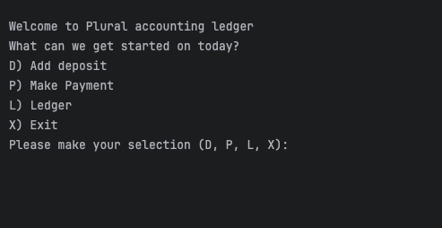

This takes the user to the home page of the application, it gives them a couple options they can choose from. The options are to make a deposit, make a payment, the ledger option takes them to another screen with different menu options. Lastly if they don't want to do any of the above it gives them the option to exit the application

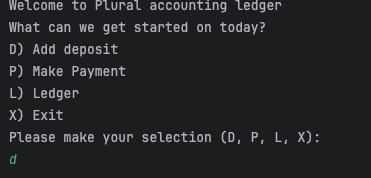
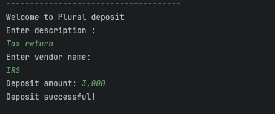

In this screenshot the user made a choice to make a depsoit into the application, once he typed out option d and hit enter the application asked the user to input the description of there deposit, the vendor that issued the funds and lastly the amount they wanted to deposit

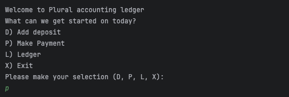
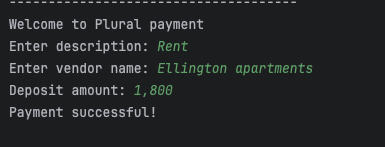

For this screenshot the user decided to make a payment they wanted to keep track of. They entered option "p", once they hit enter after typing out there option the application asks the user to input the following information, including the description of the payment, then they input the vendor name the payment is going out to. The last question the application asks is the amount they want to deposit for that certain payment.

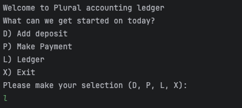
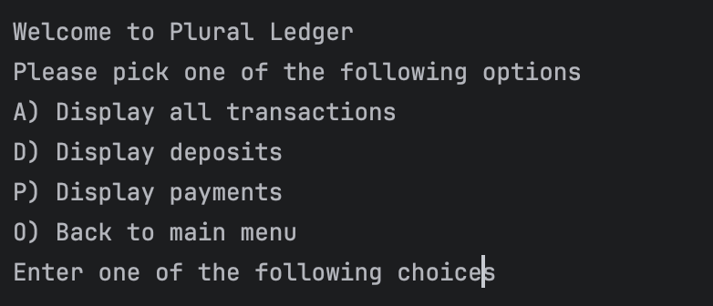

The user decided to go with the ledger option in this screenshot, which will take them to the ledger menu giving them the options to see all the transcations they made in the application such as seeing all transactions all together. If they are looking to see specific transactions such as how much they have deposited they are allowed to, as well as seeing all payments made seperatly.

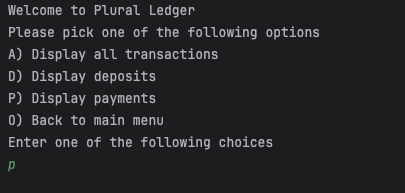
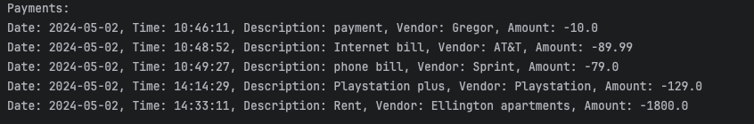

This is what the customer gets in return when they pick the option so see all payments they previously made, it pulls all the information the customer has inputed over time ans shows them the full history of payments

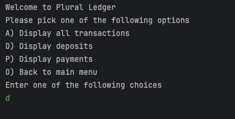
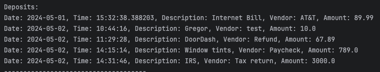

In this screenshot the user decided to display all the deposits they made over time, the application goes into the all the data stored and pulls all the deposits made over time.

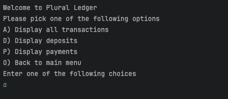
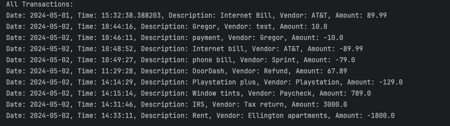

The last option the user has is to display everything all together which inludes all the payments and deposit made by the user, it displays all transactions.

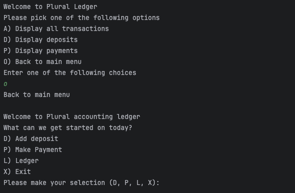

Once the user is done seeing all the transaction history, it gives them the option to go back to the main menu in case they want to make another deposit or payment

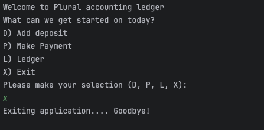

Once the user is back to the main menu they can type out the option to exit the application if they no longer need to use the application

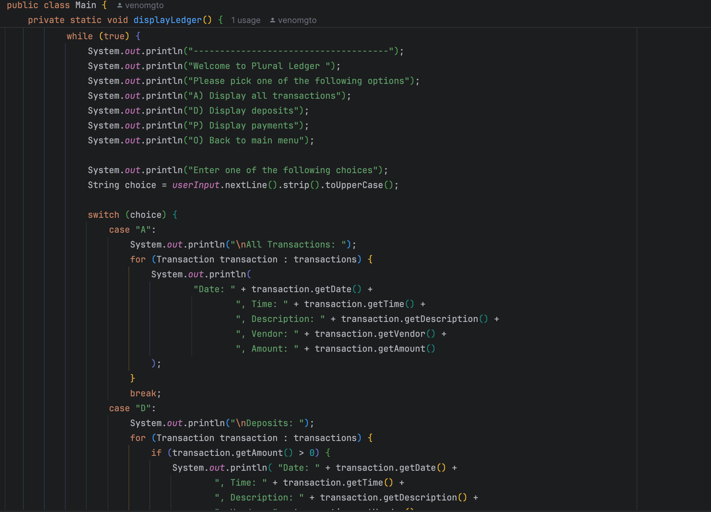

In the screenshot above I choose this piece of code because this was the hardest part for me out of my entire project, because it took me a while to figure out how to display all the deposits/payments the user made. It took me a while to figure out I could use an array list for each one to be able to call all the data to be able to display it separately
